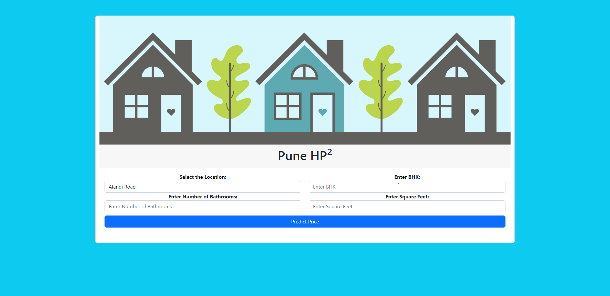
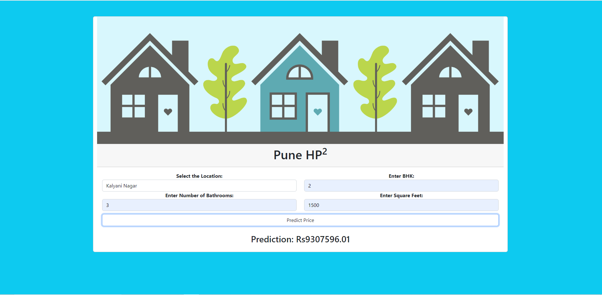

# House-Price-Prediction
This is a House Price Prediction System estimating the prices in the city of Pune (Maharashtra,India) which was developed using python , colab and flask

# This Readme Contains
* [Introduction](#introduction)
* [Technologies Used](#technologies-used)
* [Features](#features)
* [Steps](#steps)
* [Screenshots](#screenshots)
* [References](#references)

## Introduction
House prices are a significant impression of the economy, and its value ranges are of great concerns for the clients and property dealers. Since the  Housing prices escalate every year the need of strategy or technique that could predict house prices in future is required. With this project we aim to predict the house prices for users based on certain independent parameters. There are certain factors that influence house prices including physical conditions, locations, number of bedrooms and others. We are taking into consideration location , the number of bedrooms, bathrooms and total square feet area and predicting prices using linear regression techniques. The user is given the option of estimating the prices of one of the major metropolitan cities of India namely Pune. We will be developing the project using flask , javascript, python. By virtue of this project we aim to aid every user in their quest of an ideal household.

## Technologies Used
- Python and Various Python Libraries
- Colab
- Flask
- Javascript, HTML, CSS
- Bootstrap

## Features

## Steps 

## Screenshots
Before the input

After the output

## References
* <a href='https://www.kaggle.com/datasets/saipavansaketh/pune-house-data?select=Pune+house+data.csv'>Dataset</a>
* <a href='https://youtu.be/DVxkI1VmpCk'>https://youtu.be/DVxkI1VmpCk</a>
